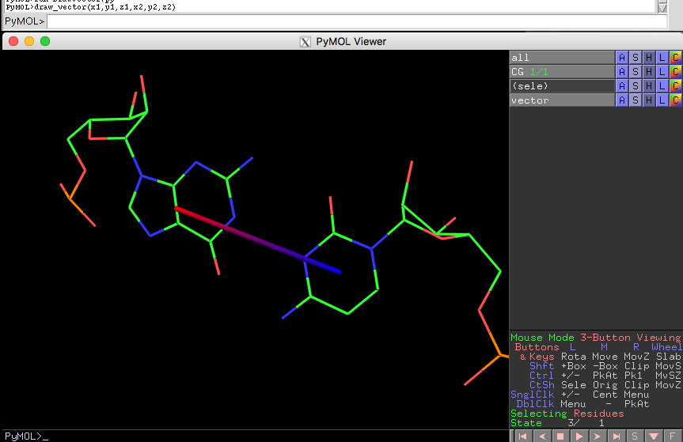
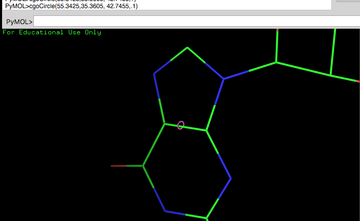

Read more: https://pymolwiki.org/index.php/Category:CGO

# Draw a point

    pseudoatom pt1, pos=[x1, y1, z1]
    pseudoatom pt2, pos=[x2, y2, z2]
    distance /pt1, /pt2
    set dash_gap, 0
    
    You can also create CGO lines between two points, if you want.

https://sourceforge.net/p/pymol/mailman/message/25795427/

# Draw a vector

    x1, y1,z1 =  54.729 , 28.9375, 41.421
	x2, y2,z2 = 55.3425 ,35.3605,  42.7455

`draw_vector(x1,y1,z1,x2,y2,z2)` goes from blue to red

# Draw a circle

`cgoCircle(55,35,41,.1)` on GC.pdb

https://pymolwiki.org/index.php/CgoCircle

# Draw a cylinder

	from pymol.cgo import *    # get constants
	from pymol import cmd
	obj = []
	obj.extend([ CYLINDER, 67.4734,39.1894,30.9236,55.5007,32.2414,42.8594, 2, 1, 0, 0, 1,0,0 ])
	cmd.load_cgo(obj,'cg1')

http://www.pymolwiki.org/index.php/CGOCylinder

# Install

    run ~/work/src/rna-pdb-tools/rna_pdb_tools/utils/pymol_drawing/CgoCircle.py
    run ~/work/src/rna-pdb-tools/rna_pdb_tools/utils/pymol_drawing/DrawVector.py

