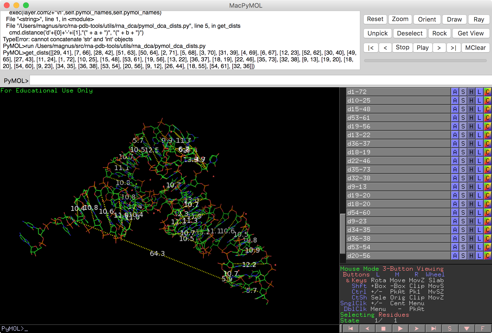

# RNA_DCA (DeCoupling Analysis) 

> Non-coding RNAs are ubiquitous, but the discovery of new RNA gene sequences far outpaces the research on the structure and functional interactions of these RNA gene sequences. We mine the evolutionary sequence record to derive precise information about the function and structure of RNAs and RNA-protein complexes. As in protein structure prediction, we use maximum entropy global probability models of sequence co-variation to infer evolutionarily constrained nucleotide-nucleotide interactions within RNA molecules and nucleotide-amino acid interactions in RNA-protein complexes. The predicted contacts allow all-atom blinded 3D structure prediction at good accuracy for several known RNA structures and RNA-protein complexes. For unknown structures, we predict contacts in 160 non-coding RNA families. Beyond 3D structure prediction, evolutionary couplings help identify important functional interactions-e.g., at switch points in riboswitches and at a complex nucleation site in HIV. Aided by increasing sequence accumulation, evolutionary coupling analysis can accelerate the discovery of functional interactions and 3D structures involving RNA. The evolutionary signals for RNA 3D structure and interactions are detected by applying new algorithms to the analysis of thousands of genomes. This approach pinpoints an important interaction for HIV genome transport and predicts 3D contacts for hundreds of RNAs with unknown structure. 
> 
> [1] C. Weinreb, A. J. J. Riesselman, J. B. B. Ingraham, T. Gross, C. Sander, and D. S. S. Marks, “3D RNA and Functional Interactions from Evolutionary Couplings,” Cell, pp. 1–13, 2015.

- <http://www.sciencedirect.com/science/article/pii/S0092867416303282>
- <https://marks.hms.harvard.edu/ev_rna/>
- <https://github.com/debbiemarkslab/plmc>

Run plmc:
 
    ➜  examples git:(master) ✗ plmc -c rf5.scores -a .ACGU  RF00005.afa.txt
    953 valid sequences out of 954
    118 sites
    Effective number of samples: 245.7     	(80% identical neighborhood = 1.000 samples)
    iter   	time   	cond   	fx     	-loglk 	||h||  	||e||
    1      	0.5    	41.97  	21624.0	21490.3	40.4   	1.1
    2      	0.8    	80.17  	20073.2	17825.3	40.5   	4.7
    3      	1.0    	41.41  	19113.0	16541.6	40.5   	5.1

.. which creates a file with coupling scores:

    ➜  examples git:(master) ✗ head rf5.scores
    1 - 2 - 0 0.028189
    1 - 3 - 0 -0.028578
    1 - 4 - 0 0.012220
    1 - 5 - 0 0.016589
    1 - 6 - 0 -0.023366

where `resi_i, focus_i, resi_j, focus_j, 0, ec_score`. 

Select interactions: 

	➜  rna_dca git:(master) ✗ python rna_dca_select_interactions.py examples/rf5.scores
	L 59
	       i    j    scores
	3675  38   51  0.700352
	789    7  110  0.673785
	3596  37   52  0.657058
    [...]
	5093  58   79  0.114991
	5082  58   68  0.114672
	Output file created:examples/rf5.scores_parsed.csv

.. and map the selected interactions using a gapped seq of your target:

    GCCCGGAUAGCUCAGUCGGUAGAGCAUCAGACUUUUAAUCUGAGGGUCCAGGGUUCAAGUCCCUGUUCGGGCGCC   # >1FIR:A|PDBID|CHAIN|SEQUENCE
    GCCCGGAUAGCUCAGUCGGUAGAGCAUCAGACUUUUAAUCUGAGGGUCCAGGGUUCAAGUCCCUGUUCGGGCG     # >AP0004426/20221950
	GCCCGGAU.A.GCUCAGUC..GGU...AGAGCA.U.CAGAC.UUUUAAUCUG.AGG........................GU..CCAG.GGU.UCA.AG..UCCCU.G.UUCGGGC.G #	>AP000442.6/2022.1950 

.. and run the script:

	➜  rna_dca git:(master) ✗ python rna_dca_mapping.py examples/1fir_gapped.fa examples/rf5.scores_parsed.csv
	> 1fir
	GCCCGGAU.A.GCUCAGUC..GGU...AGAGCA.U.CAGAC.UUUUAAUCUG.AGG........................GU..CCAG.GGU.UCA.AG..UCCCU.G.UUCGGGC.G
	input: examples/1fir_gapped.fa
	interactions:
	[(38, 51), (7, 110), (37, 52), (88, 105), (87, 106), (2, 115), (5, 112), (3, 114), (40, 49), (4, 113), (6, 111), (14, 30), (90, 104), (39, 50), (86, 108), (35, 54), (13, 31), (1, 116), (12, 32), (17, 85), (91, 103), (23, 95), (15, 29), (59, 79), (46, 47), (22, 23), (29, 81), (60, 78), (62, 77), (58, 80), (45, 118), (41, 48), (10, 15), (23, 24), (22, 24), (92, 102), (10, 30), (44, 45), (67, 68), (66, 67), (63, 76), (19, 21), (66, 68), (46, 48), (91, 92), (24, 95), (10, 14), (33, 55), (22, 94), (92, 103), (58, 59), (41, 46), (79, 80), (64, 75), (78, 80), (58, 67), (67, 80), (58, 79), (58, 68)]
	A U
	(38, 51) -> 29 41
 
    ./simrna_get_restraints.py couplingsfileSaveRF00005_parsed_mapped  

Install PyMOL plugin to view the interactions with PyMOL:

    run <path>rna-pdb-tools/utils/rna_dca/pymol_dca_dists.py

<pre>
>1fir
GCCCGgAUAgCUCAGuCGGuAGAGCAuCAGACUuUUaAuCUGAGGguccAGGGuuCAaGUCCCUGUUCGGGCGCCA
(((((((..((((.....[..))))..(((.........)))......(((((..]....))))))))))))....
</pre>

**Figure**. `get_dists(<output of the script, python list>)`

To get interactions:

	PyMOL>get_dists([[29, 41], [7, 66], [28, 42], [51, 63], [50, 64], [2, 71], [5, 68], [3, 70], [31, 39], [4, 69], [6, 67], [12, 23], [52, 62], [30, 40], [49, 65], [27, 43], [11, 24], [1, 72], [10, 25], [15, 48], [53, 61], [19, 56], [13, 22], [36, 37], [18, 19], [22, 46], [35, 73], [32, 38], [9, 13], [19, 20], [18, 20], [54, 60], [9, 23], [34, 35], [36, 38], [53, 54], [20, 56], [9, 12], [26, 44], [18, 55], [54, 61], [32, 36]])`

